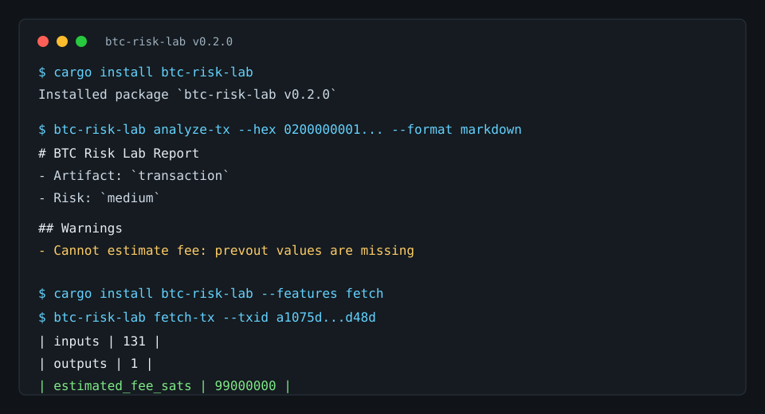

# btc-risk-lab

[](https://crates.io/crates/btc-risk-lab)
[](https://crates.io/crates/btc-risk-lab)

`btc-risk-lab` is an explainable Bitcoin risk analysis CLI written in Rust.



It analyzes Bitcoin artifacts such as raw transactions, PSBTs, scripts, and output descriptors, then produces a technical report in JSON or Markdown. The goal is not to replace wallet software or consensus validation. The goal is to make transaction structure, missing data, policy signals, and review assumptions visible.

This repository is also a public engineering artifact by **Jose Robles**, Head of Engineering / AI Architect, showing hands-on work across Rust, Bitcoin/blockchain, AI-assisted reporting, security-minded product boundaries, and technical due diligence.

## Why It Exists

Bitcoin and Web3 systems often fail at the edges: incomplete transaction context, unclear signing policy, weak operational review, or hidden assumptions around scripts and PSBTs.

`btc-risk-lab` demonstrates how a senior engineering team can turn low-level artifacts into reviewable evidence:

- deterministic Rust analysis first
- explicit missing-data dependencies
- human-readable warning explanations
- JSON output suitable for downstream automation
- consolidated review packs for descriptor, PSBT, transaction, script, policy, and notes directories
- policy-pack reports for custody, audit, and technical review evidence
- optional AI summary layer that never replaces the technical report
- clear security boundaries around private keys and funds

## What It Demonstrates

This MVP is intentionally small, but it is structured like a real due diligence tool:

- Rust CLI architecture with `clap`
- Bitcoin transaction and PSBT parsing via `rust-bitcoin`
- descriptor parsing and policy hints via `miniscript`
- script inspection heuristics
- structured reporting with `serde`
- Markdown and JSON output
- review-pack reports with cross-artifact checks
- policy-pack reports with policy notes and metadata evidence
- CI with `fmt`, `clippy`, and tests
- a security posture that avoids custody, signing, seed phrases, and private key handling

## Install

From crates.io:

```bash
cargo install btc-risk-lab
```

Install the optional public Esplora fetch command:

```bash
cargo install btc-risk-lab --features fetch
```

From source:

```bash
git clone https://github.com/josediegorobles/btc-risk-lab.git
cd btc-risk-lab
cargo build --release
```

Run locally during development:

```bash
cargo run -- analyze-tx --input examples/tx.json --format markdown
```

## Commands

Analyze a transaction JSON file:

```bash
btc-risk-lab analyze-tx --input examples/tx.json --format markdown
```

Analyze a raw transaction hex string directly:

```bash
btc-risk-lab analyze-tx --hex 0200000001... --format markdown
```

When no prevouts are provided, fee analysis is reported as unavailable instead of guessed.

Fetch a public transaction from mempool.space Esplora and analyze it with prevouts:

```bash
btc-risk-lab fetch-tx --txid a1075db55d416d3ca199f55b6084e2115b9345e16c5cf302fc80e9d5fbf5d48d --format markdown
```

`fetch-tx` is behind the non-default `fetch` feature and only performs read-only HTTPS GET requests to public transaction endpoints. It does not broadcast transactions, sign, custody funds, or handle keys.

Analyze a base64 PSBT:

```bash
btc-risk-lab analyze-psbt --input examples/sample.psbt --format json
```

Analyze a script as hex or a small ASM subset:

```bash
btc-risk-lab analyze-script --script "OP_CHECKMULTISIG OP_CHECKSEQUENCEVERIFY" --format markdown
```

Analyze an output descriptor:

```bash
btc-risk-lab analyze-descriptor --descriptor "wsh(sortedmulti(2,02...,03...,04...))" --format markdown
```

Analyze a local review pack directory:

```bash
btc-risk-lab review-pack --input tests/fixtures/review-packs/complete --format markdown
```

Write a review pack report to a file:

```bash
btc-risk-lab review-pack --input ./review-pack --format json --output review-pack-report.json
```

`review-pack` looks for these optional files:

- `descriptor.txt`
- `psbt.base64`
- `tx.json`
- `script.txt`
- `policy.json`
- `notes.md`

It reuses the existing descriptor, PSBT, transaction, and script analyzers, then emits a schema `0.4` `ReviewPackReport` with detected artifacts, per-artifact summaries, consolidated risk, warnings, missing data, cross-artifact findings, review questions, and limitations.

Analyze a policy pack directory for custody or audit review:

```bash
btc-risk-lab policy-pack --input tests/fixtures/policy-packs/multisig-timelock --format markdown
```

Write a policy pack report to a file:

```bash
btc-risk-lab policy-pack --input ./policy-pack --format markdown --output docs/policy-pack-sample.md
```

`policy-pack` reuses `review-pack` and the existing descriptor, PSBT, transaction, and script analyzers. It adds policy evidence handling for:

- `policy.md`
- `policy.yaml` or `policy.yml`
- `policy.json`
- `notes.md`
- `metadata.json`
- `metadata.yaml` or `metadata.yml`

The schema `0.5` `PolicyPackReport` includes artifacts detected, evidence document summaries, per-artifact summaries, consolidated findings, warnings, missing evidence, review questions, and clear limitations. A public sample is available at [`docs/policy-pack-sample.md`](docs/policy-pack-sample.md).

Generate an optional executive summary from an existing JSON report:

```bash
BTC_RISK_LAB_AI_API_KEY=... cargo run --features ai -- summarize --input report.json --provider openai
```

The `summarize` command is behind the non-default `ai` feature. Builds compiled without that feature return `compiled without ai feature`.

When enabled, the OpenAI-compatible provider calls `BTC_RISK_LAB_AI_BASE_URL` or `https://api.openai.com/v1` by default, authenticates with `BTC_RISK_LAB_AI_API_KEY`, and optionally uses `BTC_RISK_LAB_AI_MODEL` or `gpt-4o-mini` by default. The HTTP client has a hard 20 second timeout.

The only input sent to the provider is the already-produced btc-risk-lab JSON report passed via `--input`. The command does not read or upload raw transaction hex files, PSBT files, descriptors, scripts, policy notes, wallet files, keys, seed phrases, or signing material. Output is marked `AI-assisted draft` and must be reviewed against the underlying technical report.

## Transaction Input Format

Transactions are provided as JSON so fee analysis can explain whether the required UTXO context is present.

```json
{
  "hex": "0200000001...",
  "prevouts": [
    {
      "value_sats": 2000,
      "script_pubkey": "00140000000000000000000000000000000000000000"
    }
  ]
}
```

Bitcoin transactions do not include the value of the UTXOs they spend. If `prevouts` are missing, `btc-risk-lab` reports that fee estimation is unavailable instead of inventing a number.

## Sample Output

```markdown
# BTC Risk Lab Report

- Artifact: `transaction`
- Risk: `medium`

## Summary

| Signal | Value |
|---|---:|
| inputs | 1 |
| outputs | 2 |
| output_value_sats | 1100 |
| estimated_fee_sats | 900 |

## Warnings

- **Dust-like output detected** (`Medium`, `dust-output`): At least one non-zero output is below the heuristic dust threshold for its script type.
```

## Analysis Signals

Current analysis includes:

- number of inputs
- number of outputs
- output value in sats
- output script type where detectable
- address rendering where detectable
- dust-like outputs
- fee estimation when input UTXO values are available
- multisig signals
- absolute and relative timelock signals
- descriptor type and script type
- descriptor sanity check through `miniscript`
- descriptor max satisfaction weight where available
- threshold and multisig policy hints
- review-pack cross-artifact checks for descriptor/PSBT policy signals and PSBT/transaction input-output counts
- policy-pack findings for policy notes, optional metadata, missing evidence, and custodian/auditor review questions
- script complexity score
- report schema versioning
- missing-data dependencies
- risk classification: `low`, `medium`, `high`, or `unknown`
- human-readable warning explanations

## Security Boundaries

`btc-risk-lab` does **not**:

- create wallets
- sign transactions
- custody funds
- handle private keys
- request seed phrases
- broadcast transactions
- make network calls from `review-pack`
- make network calls from `policy-pack`
- promise consensus-level validation
- send secrets to an LLM

It is an analysis, explainability, and reporting tool.

## Privacy

The base analyzer runs locally and does not require network access.

AI support is optional and isolated behind the `ai` feature flag. When `summarize` is run with the OpenAI-compatible provider, it sends only the already-produced technical JSON report to the configured AI endpoint and labels the result as an `AI-assisted draft`. Private keys, seed phrases, wallet files, raw artifacts, and signing material are out of scope by design.

## Limitations

This MVP uses heuristics. It does not perform full Bitcoin Core policy validation, mempool acceptance simulation, chain lookup, script execution, wallet state analysis, or consensus-level validation.

Risk classifications are only as complete as the artifact data provided. Missing UTXO data, omitted redeem scripts, absent witness scripts, incomplete PSBT maps, descriptors without operational wallet context, and review packs without matching descriptor/PSBT/transaction artifacts can all reduce confidence.

Review-pack cross-artifact checks are intentionally limited. The tool compares available policy signals and input/output counts, but it does not prove descriptor-to-PSBT equivalence, transaction extraction from PSBT, key origin correctness, signer-set ownership, or wallet state.

Policy-pack reports are evidence packs, not approvals. They summarize Markdown/YAML policy notes structurally, compare available analyzer signals, and surface missing evidence, but they do not semantically validate natural-language policy commitments or prove wallet ownership.

## Technical Due Diligence Connection

The same approach used here applies to technical due diligence for Bitcoin, Web3, fintech, and AI systems:

- make implicit risks explicit
- separate deterministic facts from interpretation
- expose missing evidence
- document operational assumptions
- build machine-readable reports that executives can still understand
- keep security and privacy boundaries visible in the product design

For clients, this repo is a compact example of how Jose Robles approaches engineering leadership: practical Rust implementation, domain-aware Bitcoin analysis, AI used as a reporting layer instead of a source of truth, and clear communication of risk.

## Development

```bash
cargo fmt --all
cargo clippy --all-targets --all-features -- -D warnings
cargo test --all-features
```

## License

MIT
